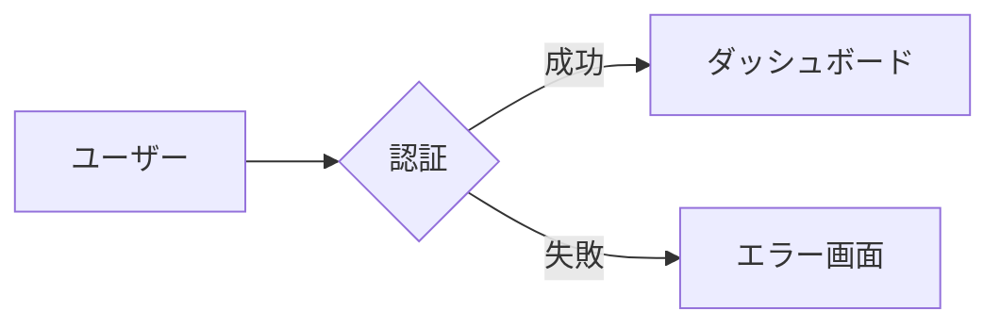
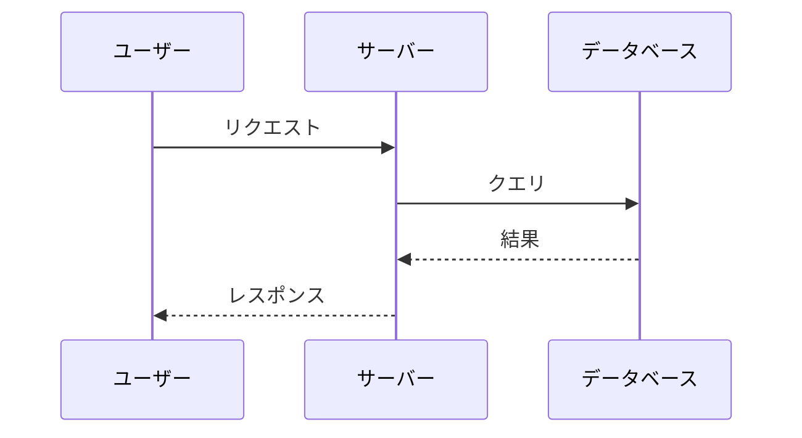
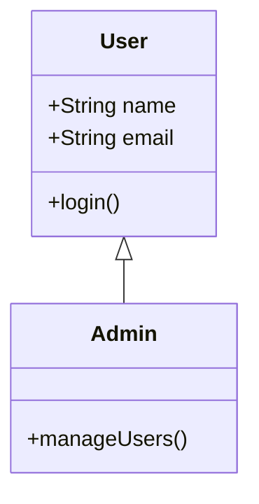

# Mermaid テスト

## フローチャート

```mermaid
flowchart LR
    A[ユーザー] --> B{認証}
    B -->|成功| C[ダッシュボード]
    B -->|失敗| D[エラー画面]
```

## シーケンス図

```mermaid
sequenceDiagram
    participant U as ユーザー
    participant S as サーバー
    participant DB as データベース
    U->>S: リクエスト
    S->>DB: クエリ
    DB-->>S: 結果
    S-->>U: レスポンス
```

## クラス図

```mermaid
classDiagram
    class User {
        +String name
        +String email
        +login()
    }
    class Admin {
        +manageUsers()
    }
    User <|-- Admin
```
